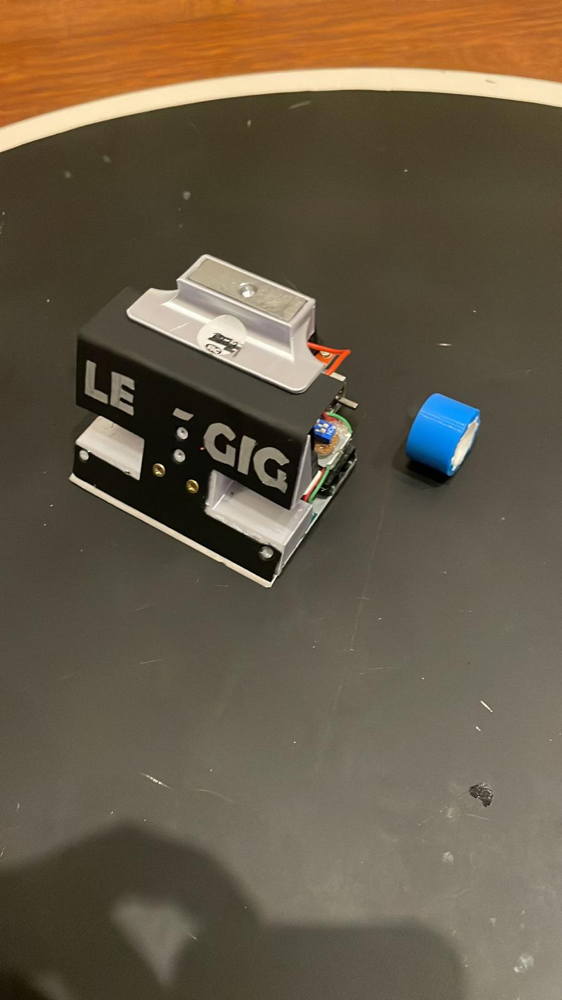
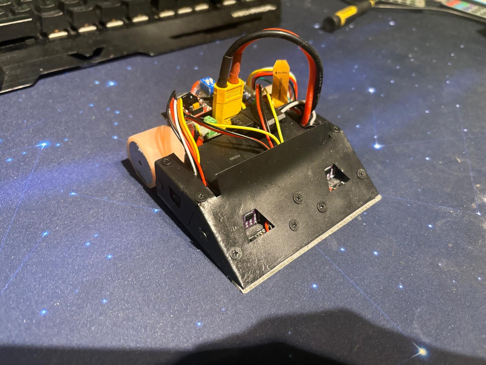
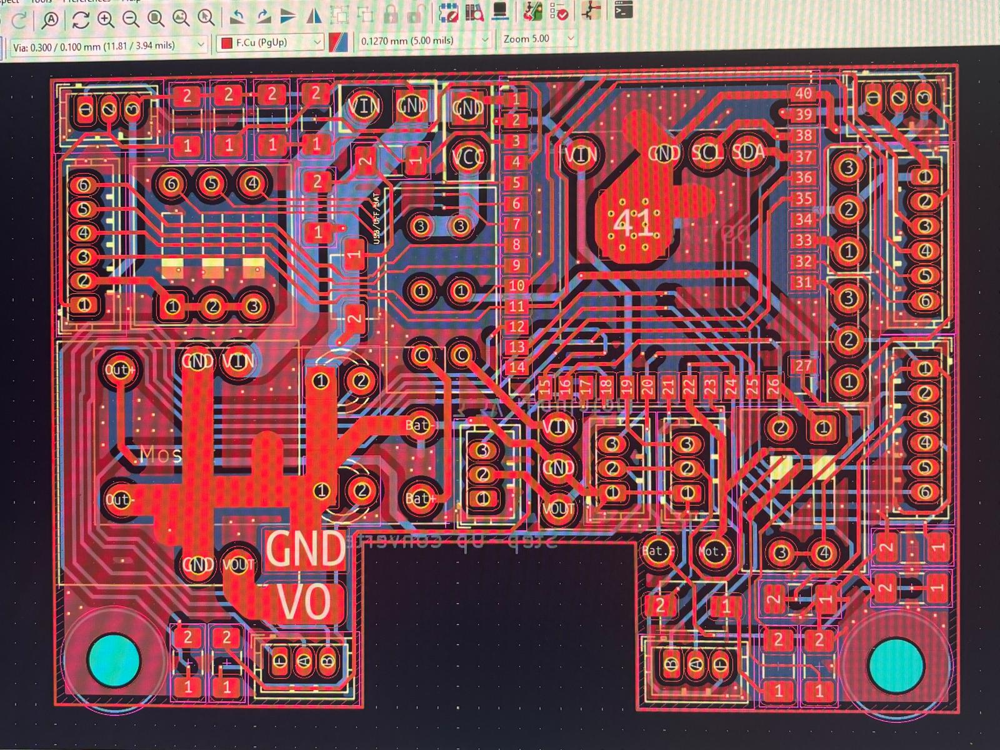

# Autonomous Mini-Sumo Evolution (2019-2025)

This repository documents my 5-year journey in autonomous robotics, moving from basic hobbyist circuits to a professional-grade ESP32-S3 system. 

## 2025 Version: The "Powerhouse"
My latest iteration is a high-performance robot optimized for speed, low profile (1.4cm), and electromagnetic resilience.

### **Key Technical Specs:**
* **MCU:** ESP32-S3 (Dual-Core) utilizing **FreeRTOS (xTasks)** to decouple sensor polling from motor control.
* **Sensing:** 8x8 Matrix Time-of-Flight (ToF) sensors with **Bitwise Masking** for zero-latency detection.
* **Power:** 6S LiPo rail with **Logic Isolation** (dedicated 3.7V cell for MCU/Sensors) to prevent brownouts.
* **Hardware:** Custom 2-layer PCB featuring **Ground Patching** and Faraday-shielding to mitigate high-frequency EMI.

---

## Major Engineering Challenges & Solutions

### 1. EMI Mitigation (Electromagnetic Interference)
* **Problem:** High-power motors induced massive noise on I2C lines, causing sensor "blindness".
* **Solution:** Implemented ground planes on both PCB layers and used grounded copper tape shields around motor mounts. This significantly improved signal integrity even at 22.2V power levels.

### 2. Power Integrity & Brownout Prevention
* **Problem:** Motor inrush current caused voltage drops that triggered MCU resets.
* **Solution:** Total isolation of the logic rail from the power rail. Switched from large decoupling capacitors to a dual-battery system, ensuring a stable 3.3V/5V environment.

### 3. Diagnostics & Fail-Safes (POST)
* **Implementation:** Developed a **Power-On Self-Test (POST)** routine. If sensors fail to initialize, the robot enters an error state (rotation + red LED blinking) for rapid field diagnosis.

---

## Evolution Timeline

* **2019-2022:** Introduction to robotics. Learned GPIO, motor drivers, and basic asynchronous logic using `millis()`.
* **2023:** Transitioned to **RP2040** and DIY PCB etching. Focused on torque optimization and CNC-milled chassis.
* **2024:** Migrated to **ESP32-C3** and ToF sensors. Solved address conflicts using I2C Multiplexers.
* **2025:** Reached the current state of the art with **SMD reflow soldering**, adjustable scraper blades, and multi-core task optimization.

---

## Media
- [First Robot 2022](media/first_robot.jpeg)

- [Final Robot 2025](media/final_robot.jpeg)

- [PCB Ground Patching Detail](media/pcb_design.jpeg)

